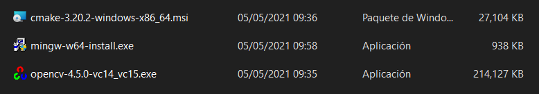

# PARAM_PROCESSCPP

/*compile:  g++ -o prueba prueba.cpp -IC:\opencv\build\include -LC:\opencv\build\lib -llibopencv_core450 -llibopencv_highgui450 -llibopencv_calib3d450 -llibopencv_core450 -llibopencv_dnn450 -llibopencv_features2d450 -llibopencv_flann450 -llibopencv_gapi450 -llibopencv_highgui450 -llibopencv_imgcodecs450 -llibopencv_imgproc450 -llibopencv_ml450 -llibopencv_objdetect450 -llibopencv_photo450 -llibopencv_stitching450 -llibopencv_video450 -llibopencv_videoio450*/

+Para su compilación y ejecución requiere tener instalado opencv 4.50.
<html>
    <head>
        <meta charset="UTF-8">
    </head>
    <body>
        <h1>COMO COMPILAR OPENCV</h1>
        <h2>  Prerequisitos  </h2>
        </img>
        Descarga de <a href="https://www.dropbox.com/sh/oqlm559dbgpkjnh/AADK-Qc6eJYXH9d-indPd0nBa?dl=0" target="_blank"> aquí </a>
    </body>

</html>