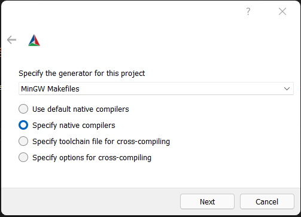
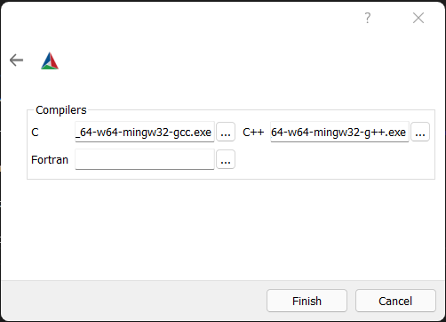
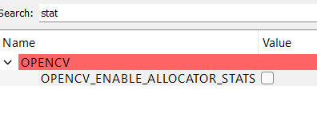
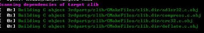
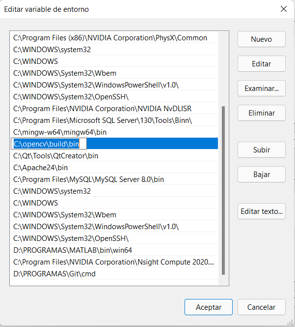

# PARAM_PROCESSCPP

/*compile:  g++ -o prueba prueba.cpp -IC:\opencv\build\include -LC:\opencv\build\lib -llibopencv_core450 -llibopencv_highgui450 -llibopencv_calib3d450 -llibopencv_core450 -llibopencv_dnn450 -llibopencv_features2d450 -llibopencv_flann450 -llibopencv_gapi450 -llibopencv_highgui450 -llibopencv_imgcodecs450 -llibopencv_imgproc450 -llibopencv_ml450 -llibopencv_objdetect450 -llibopencv_photo450 -llibopencv_stitching450 -llibopencv_video450 -llibopencv_videoio450*/

+Para su compilación y ejecución requiere tener instalado opencv 4.5.0.
<html>
    <head>
        <meta charset="UTF-8">
    </head>
    <body>
        <ul>
            <li> PRUEBA </li>
        </ul>
        <h1>COMO COMPILAR OPENCV</h1>
        <h2>  Prerrequisitos  </h2>
        </img>
        
Descarga <a href="https://www.dropbox.com/sh/oqlm559dbgpkjnh/AADK-Qc6eJYXH9d-indPd0nBa?dl=0" target="_blank"> aquí.  </a>
        <h2>  Configuración del make  </h2>
        Una vez todo descargado se procede a instalar el cmake y el mingw, despues se ejecuta el opencv 4.5.0 y se extrae en donde se quiera.  

        </img>
        Despues se entra a la carpeta que se extrajo la cual es opencv. Adentro se mostrara esta ventana. <b>NOTA: Si el directorio build no esta se debera crear manualmente.</b>
        </img>
        Despues se abre el cmake previamente instalado y de debera configurar primero de la siguiente manera.
        </img>
        Despues se le da al boton configure y abrira una ventana la cual se debera de configurar así, despues se le da a next.
        </img>
        Pedira los compiladores a usar. Se debera meter la siguiente ruta para c y c++:  {instalation_path}/mingw-w64/mingw64/bin/x86_64-w64-mingw32-gcc.exe <-- para C y {instalation_path}/mingw-w64/mingw64/bin/x86_64-w64-mingw32-g++.exe <-- para c++. Despues se le da finalizar
        </img>
        Una vez finalizado se debera de deshabilitar el OPENCV_ENABLE_ALLOCATOR_STATS
        </img>
        Despues se le da a configurar y cuando termine el proceso se le data a generar. Una vez generado el archivo make se puede cerrar cmake-gui. 
        <h2>  Compilación e instalación  </h2>
        Para la compilación se debe abrir una terminal en la carpeta {extract_directory}/opencv/build y ahi ejecutar el comando <i>mingw32-make.exe</i> y comenzara a compilar todo lo necesario para funcionar. Esto puede tardar varios minutos dependiendo el procesador que se cuente.
        </img> 
        El resultado debera de ser similar al de la imagen.  
        Despues de que termine la compilación se debe de ejecutar el comando <i>mingw32-make.exe install</i> para instalar la libreria.
        <h2>  Configuración del path  </h2>
        Abra las variables de entorno del sistema y configure en la variable path la ruta {extract_directory}/opencv/build.
        </img> 
    </body> 
</html>